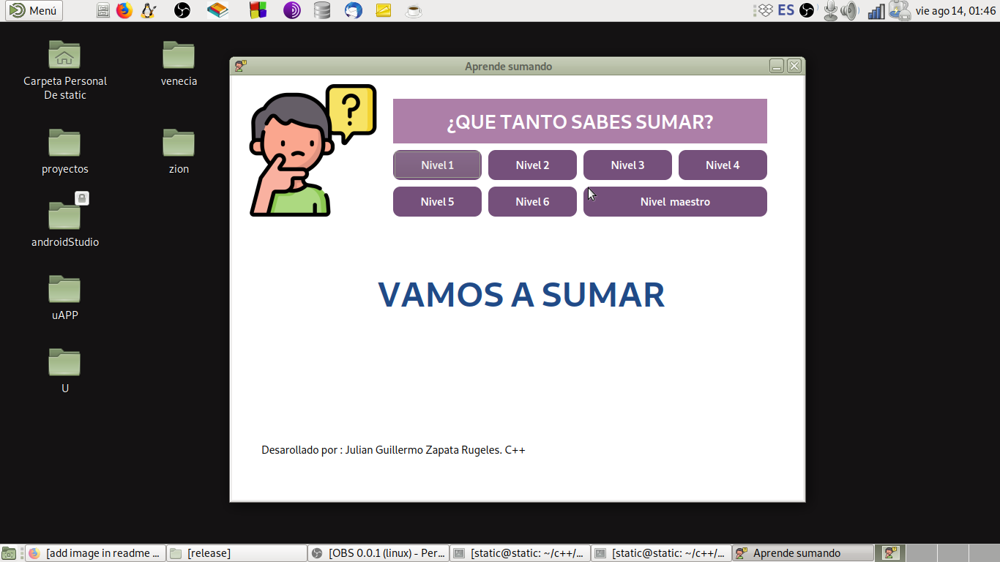

# Juego_Aprende_Sumado
Es un juego sencillo hecho en C++ que pregunta por el resultado de la suma
dependiendo del nivel este aumentará la dificultad de la suma

cada ronda consta de 10 sumas que se pueden desarollar facilmente
el programa es de uso libre
se puede modificar cualquier componente

